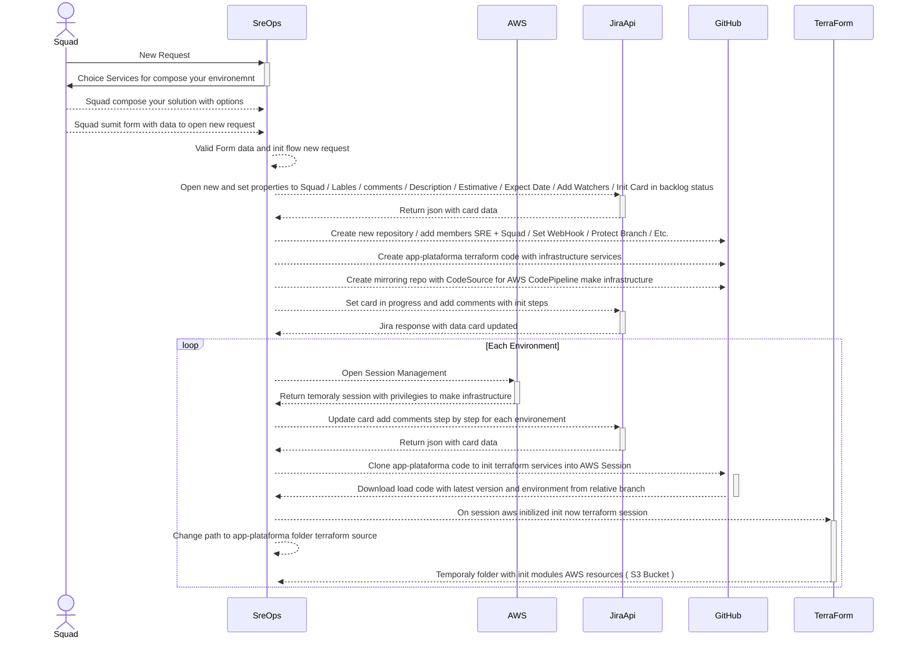

# strech

```mermaid
sequenceDiagram
    Actor Squad
    participant SreOps
    participant AWS 
    participant JiraApi
    participant GitHub
    participant TerraForm
    Squad->>+SreOps : New Request
    SreOps->>-Squad : Choice Services for compose your environemnt
    Squad-->>+SreOps : Squad compose your solution with options
    Squad-->>+SreOps : Squad sumit form with data to open new request
    SreOps-->>+SreOps : Valid Form data and init flow new request
    SreOps-->>+JiraApi : Open new and set properties to Squad / Lables / comments / Description / Estimative / Expect Date / Add Watchers / Init Card in backlog status
    JiraApi-->>-SreOps : Return json with card data
    SreOps-->>+GitHub : Create new repository / add members SRE + Squad / Set WebHook / Protect Branch / Etc. 
    SreOps-->>+GitHub : Create app-plataforma  terraform code with infrastructure services
    SreOps-->>+GitHub : Create mirroring repo with CodeSource for AWS CodePipeline make infrastructure
    SreOps-->>+JiraApi : Set card in progress and add comments with init steps
    JiraApi-->>-SreOps : Jira response with data card updated
    loop Each Environment
        SreOps-->>+AWS : Open Session Management 
        AWS-->>-SreOps : Return temoraly session with privilegies to make infrastructure
        SreOps-->>+JiraApi : Update card add comments step by step for each environement
        JiraApi-->>-SreOps : Return json with card data  
        SreOps-->>+GitHub : Clone app-plataforma code to init terraform services into AWS Session
        GitHub-->>-SreOps : Download load code with latest version and environment from relative branch
        SreOps-->>+TerraForm : On session aws initilized init now terraform session 
        SreOps-->>+SreOps : Change path to app-plataforma folder terraform source
        TerraForm-->>-SreOps : Temporaly folder with init modules AWS resources ( S3 Bucket )

        
    end

```